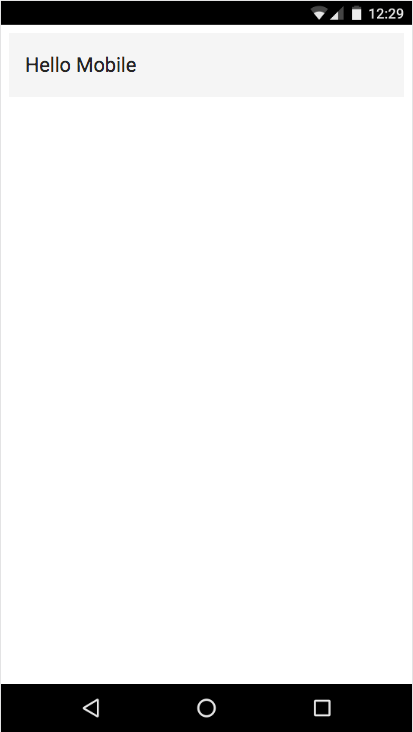
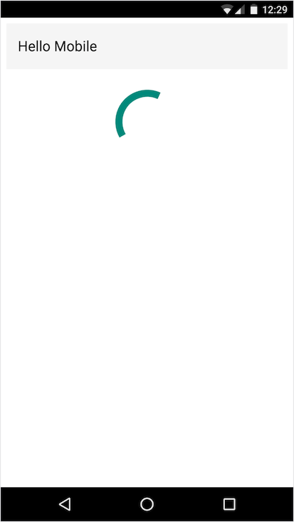

# App Shell

This guide assumes that the [CLI setup guide](./cli-setup.md) has been completed.

Let's build the App Shell to our app. App Shell is an architecture that focuses on
providing an instant-loading experience to users by rendering a "shell" of an
application immediately when the first document is returned from the server, before
any other assets have loaded. Read more about it
on [developers.google.com](https://developers.google.com/web/updates/2015/11/app-shell?hl=en).

By creating a new project with Angular CLI and the `--mobile` flag, the application already
has the build step configured to generate an App Shell from the app's root component. It's
up to you, the developer, to evolve the App Shell as your app evolves.

In this guide, we'll use the main app component that Angular CLI created for us to
easily generate an App Shell. Our app shell will just have an Angular Material toolbar
with the name of our app.

Let's install the Angular Material toolbar and Angular Material core packages from npm.

```
$ npm install --save @angular2-material/toolbar @angular2-material/core
```

(Note: this recipe was written as of Angular Material 2 alpha.4)

There are a couple of steps to let the CLI know how to serve the Angular Material toolbar assets.
First, open src/system-config.ts, and add a SystemJS config entry for the toolbar in the existing config object:

`src/system-config.ts`:
```typescript
/***********************************************************************************************
 * User Configuration.
 **********************************************************************************************/
/** Map relative paths to URLs. */
const map: any = {
  '@angular2-material': 'vendor/@angular2-material'
};

/** User packages configuration. */
const packages: any = {
  '@angular2-material/toolbar': {
    defaultExtension: 'js',
    main: 'toolbar.js'
  }
};
```

This tells the [SystemJS JavaScript loader](https://github.com/systemjs/systemjs), which Angular CLI
uses to load and bundle JS files, how to load assets when a module imports `@angular2-material/toolbar`.

The second step to make the package available is to open angular-cli-build.js
in the project's root directory, and add an entry to the `vendorNpmFiles` array:

`angular-cli-build.js`:

```typescript
var Angular2App = require('angular-cli/lib/broccoli/angular2-app');
module.exports = function(defaults) {
  return new Angular2App(defaults, {
    vendorNpmFiles: [
      // ...leave default files intact
      '@angular2-material/**/*.+(js|css|map)'
    ]
  });
};
```

This will cause the CLI to copy the toolbar, and any other Angular Material
components added later, into a "vendor" directory at build time.

Note: when making changes to angular-cli-build.js, it's necessary
to kill the `ng serve` process and start again for changes to
take effect.

Now let's add the toolbar to our component.
Open src/app/hello-mobile.component.ts in your editor.
We first need to import the directives from the toolbar package like so:

`src/app/hello-mobile.component.ts`:

```typescript
import { Component } from '@angular/core';
import { APP_SHELL_DIRECTIVES } from '@angular/app-shell';
import { MdToolbar } from '@angular2-material/toolbar';
```

And then we need to register the `MdToolbar` directive with our component by adding
it to the `@Component` decorator's directives list so it can be
available in the component's view.
Here is what the `@Component` decorator and class should look like:

`src/app/hello-mobile.component.ts`:

```typescript
@Component({
  moduleId: module.id,
  selector: 'hello-mobile-app',
  template: `
  <h1>
    {{title}}
  </h1>
  `,
  styles: [],
  directives: [APP_SHELL_DIRECTIVES, MdToolbar]
})
export class HelloMobileAppComponent {
  title = 'hello-mobile works!';
}
```

Now let's add the toolbar to our template, and give it a better title.
So our final component should look like this:

`src/app/hello-mobile.component.ts`:

```typescript
import { Component } from '@angular/core';
import { APP_SHELL_DIRECTIVES } from '@angular/app-shell';
import { MdToolbar } from '@angular2-material/toolbar';

@Component({
  moduleId: module.id,
  selector: 'hello-mobile-app',
  template: `
    <md-toolbar>
      {{title}}
    </md-toolbar>
  `,
  styles: [],
  directives: [APP_SHELL_DIRECTIVES, MdToolbar]
})
export class HelloMobileAppComponent {
  title = 'Hello Mobile';
}
```

(Note about templates: Currently the App Shell build tool only supports inline
templates and CSS for components that are included in the pre-rendered shell.
Support for `templateUrl` and `styleUrls` is planned. See
[Angular CLI Issue #810](https://github.com/angular/angular-cli/issues/810).

If you're still running `ng serve`, kill it and build the app with `ng serve --prod`, and examine the generated index.html in dist/index.html.
You should see something like this:

`dist/index.html`

```html
<hello-mobile-app>
  <md-toolbar _nghost-fnt-2="">
    <div _ngcontent-fnt-2="" class="md-toolbar-layout">
      <md-toolbar-row _ngcontent-fnt-2="">
        Hello Mobile
      </md-toolbar-row>
    </div>
  </md-toolbar>
</hello-mobile-app>
```

Our App Shell plugin has automatically pre-rendered the `HelloMobileAppComponent` in
place of the `hello-mobile-app` element. The index also includes inlined CSS styles to
give styling to the toolbar so that it can be rendered immediately, without requesting
additional resources over the network. This is what the app shell should look like
before the rest of the application is loaded and bootstrapped:



Note: the app shell itself is continually re-compiled during development, but running `ng serve --prod`
or `ng build --prod` will also bundle all of the app's JavaScript into a single JS file
that gets loaded asynchronously after the App Shell is rendered. Since there is more
bundling and minification logic with the production build, it takes significantly longer,
and is therefore not recommended during active development.

`dist/index.html`:

```html
<script src="/app-concat.js" async=""></script>
```

When the application is ready,
it will seamlessly replace the app shell component with the dynamic root component.

## Providers

As we continue building our app, we'll likely add more Dependency Injection providers.
If any of the directives included in the App Shell require these providers, it will be
necessary to add the providers inside of `main-app-shell.ts`. Since our App Shell plugin
is using [Angular Universal](https://github.com/angular/universal) to prerender our App
Shell, it's okay to use providers that come with Universal, such as the Http providers.
If your App Shell depends on providers that aren't supported in NodeJS, then it's
necessary to create fake, or "Mock", implementations of the providers in a way
that will work in Node.

## Sharing the Root Component

Ideally, we'd like to use the same root component for the pre-compiled App Shell
and dynamic runtime versions of our application. This makes it easier to make sure
the App Shell transitions seamlessly to the dynamic application, and saves the
headache of maintaining two copies of the same component.

However, there are usually components that you'd like to have in your App Shell
but not your app at runtime, and vice versa. For example, we might want to have
a router outlet in our dynamic application, and a progress indicator in its place in
our App Shell. Fortunately, our app component already has a couple of
directives available that make this simple, `*shellRender` and `*shellNoRender`. These directives
are already included in the `HelloMobileAppComponent` via the `APP_SHELL_DIRECTIVES` added
to the `directives` list.

Let's add a progress indicator to our app shell to see put these directives to use. Of course,
we'll use the progress indicator provided by Angular Material.

`$ npm install --save @angular2-material/progress-circle`

We need to add an entry for the progress-circle to system-config.ts so SystemJS knows
how to load it:

`src/system-config.ts`:

```typescript
/** User packages configuration. */
const packages: any = {
  '@angular2-material/toolbar': {
    defaultExtension: 'js',
    main: 'toolbar.js'
  },
  '@angular2-material/progress-circle': {
    defaultExtension: 'js',
    main: 'progress-circle.js'
  }
};
```


Then we'll import the `MdSpinner` directive to `HelloMobileAppComponent`,
add it to our component's `directives`, and add it to our template. We'll
also a CSS rule to center and add some space around the loading indicator.

`src/app/hello-mobile.component.ts`:

```typescript
import { Component } from '@angular/core';
import { APP_SHELL_DIRECTIVES } from '@angular/app-shell';
import { MdToolbar } from '@angular2-material/toolbar';
import { MdSpinner } from '@angular2-material/progress-circle';

@Component({
  moduleId: module.id,
  selector: 'hello-mobile-app',
  template: `
    <md-toolbar>
      {{title}}
    </md-toolbar>
    <md-spinner></md-spinner>
  `,
  styles: [`
    md-spinner {
      margin: 24px auto 0;
    }
  `],
  directives: [APP_SHELL_DIRECTIVES, MdToolbar, MdSpinner]
})
export class HelloMobileAppComponent {
  title = 'Hello Mobile';
}
```

Now, as we run our app with `ng serve`, we should see this for both our App Shell and the dynamic, runtime version of our app:



But we don't want the spinner to stick around. Let's put the `*shellRender` directive to use, and specify that the spinner
should only show in the App Shell.

```html
<md-spinner *shellRender></md-spinner>
```

Now when the app is fully loaded and Angular takes over, the
spinner will disappear. Inversely, we can use the `*shellNoRender`
directive to only render components at runtime and not in the App
Shell. For example, if we add a route to our app, we can prevent
the `<router-outlet>` component from rendering any routes. Let's illustrate with a simple element that should only be shown when
the page is fully rendered.

`src/hello-mobile.component.ts`:

```html
<md-toolbar>
  {{title}}
</md-toolbar>
<md-spinner *shellRender></md-spinner>
<h1 *shellNoRender>App is Fully Rendered</h1>
```

Now if we navigate to [localhost:4200/hello] in our browser, the spinner should render when the app shell is displayed,
and the "App is Fully Rendered" test should render when Angular bootstraps the app.

---

## [Next, let's make the app offline-ready with Service Worker.](./service-worker.md)
