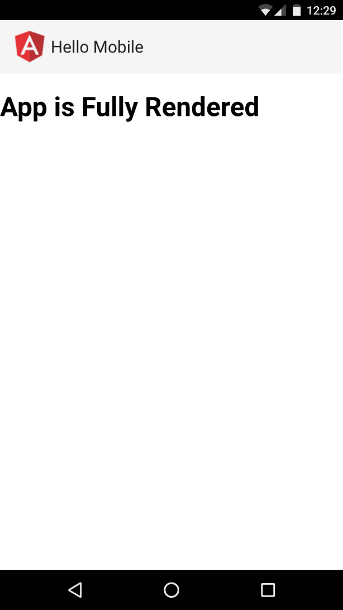
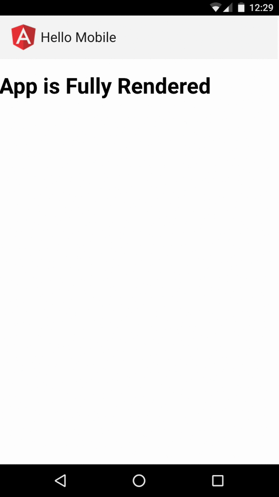

# Introduction

*This guide assumes that the [App Shell guide](https://mobile.angular.io/guides/app-shell.html) has been completed.*

Now we're going to take a look at another part of the Angular Mobile Toolkit - the App Shell Runtime Parser. The Runtime Parser is a library which has the following features:

- Automatically generates the App Shell of our application by using a fully dynamic prerendered by Universal page.
- Provides the App Shell template from the local cache automatically for each view that should use it.

This way, when the user navigates to a different view in the application she will instantly get a minimal working UI that will be later replaced with the view's full functionality. You can find more about the App Shell concept in the context of [Progressive Web Applications](https://developers.google.com/web/progressive-web-apps/) (PWA) on the [following link](https://developers.google.com/web/updates/2015/11/app-shell?hl=en).

# Introduction to the Runtime Parser

The Angular App Shell Runtime Parser works together with the App Shell directives, described in the [previous section](https://mobile.angular.io/guides/app-shell.html), and [Angular Universal](https://universal.angular.io).

Now lets dig deeper in the features of the parser!

First, lets review the "Hello Mobile" component from the previous step:

```typescript
import { Component } from '@angular/core';
import { APP_SHELL_DIRECTIVES } from '@angular/app-shell';
import { MdToolbar } from '@angular2-material/toolbar';
import { MdSpinner } from '@angular2-material/progress-circle';

@Component({
  moduleId: module.id,
  selector: 'hello-mobile-app',
  template: `
    <md-toolbar>
      <div class="icon ng"></div>
      {{title}}
    </md-toolbar>
    <md-spinner *shellRender></md-spinner>
    <h1 *shellNoRender>App is Fully Rendered</h1>
  `,
  styles: [`
    md-spinner {
      margin: 24px auto 0;
    }
    .icon {
      width: 40px;
      height: 40px;
      display: inline-block;
    }
    .icon.ng {
      background-image: url(./images/angular.png);
    }
  `],
  directives: [APP_SHELL_DIRECTIVES, MdToolbar, MdSpinner]
})
export class HelloMobileAppComponent {
  title = 'Hello Mobile';
}
```

The only difference is that in the template we've added an icon with the Angular's logo.

...and in Universal, we bootstrap our application in the following way:

```typescript
// main-app-shell.ts
import { provide } from '@angular/core';
import { APP_BASE_HREF } from '@angular/common';
import { APP_SHELL_RUNTIME_PROVIDERS } from '@angular/app-shell';
import { HelloMobileAppComponent } from './app';
import {
  REQUEST_URL,
  ORIGIN_URL
} from 'angular2-universal';

export const options = {
  directives: [
    // The component that will become the main App Shell
    HelloMobileAppComponent
  ],
  platformProviders: [
    APP_SHELL_RUNTIME_PROVIDERS,
    provide(ORIGIN_URL, {
      useValue: ''
    })
  ],
  providers: [
    // What URL should Angular be treating the app as if navigating
    provide(APP_BASE_HREF, {useValue: '/'}),
    provide(REQUEST_URL, {useValue: '/'})
  ],
  async: false,
  preboot: false
};
```

We're using almost the same configuration that was automatically generated for us by using the CLI with `--mobile` flag, fromt he previous section. The only difference in the example above is that we prerender the component using Universal and the `APP_SHELL_RUNTIME_PROVIDERS`. Once the user opens our prerendered application she will see the following user interface:



This is how the app will look once it has been completely rendered as well. However, for our App Shell we want to provide only the minimal UI which shows that the app is working and its initialization is in progress. One way to do this is by using the `APP_SHELL_BUILD_PROVIDERS` instead of `APP_SHELL_RUNTIME_PROVIDERS`. This way Universal will strip the content marked with the `shellNoRender` directive and output only the part of the application that is intended to be visualized as App Shell.

Unfortunately, this way we introduce the following problems:

- We cannot reuse the given view as the App Shell for other routes in our application.
- We must annotate the template of each individual route component which should be progressively loaded with `shellRender` and `shellNoRender` directives.

On top of that, if the final App Shell has references to external images, users with slow Internet connection will not have the best experience possible. For instance, in the example above the Angular logo in the header is an external resource which needs to be fetched from the network.

By using the Angular App Shell Runtime Parser in a Service Worker we can solve all of these issues! Lets see how!

# Exploring the Runtime Parser

First, lets take a look at a sample Service Worker which uses the Runtime Parser:

```typescript
importScripts(
  '/node_modules/reflect-metadata/Reflect.js',
  '/node_modules/systemjs/dist/system.js',
  '/system-config.js'
);

const context = <any>self;

const SHELL_PARSER_CACHE_NAME = 'shell-cache';
const APP_SHELL_URL = '/home';
const INLINE_IMAGES: string[] = ['png', 'svg', 'jpg'];
const ROUTE_DEFINITIONS = [
      '/home',
      '/about/:id'
    ];

self.addEventListener('install', function (event: any) {
  const parser = System.import('@angular/app-shell')
    .then((m: any) => {
      context.ngShellParser = m.shellParserFactory({
        APP_SHELL_URL,
        ROUTE_DEFINITIONS,
        SHELL_PARSER_CACHE_NAME,
        INLINE_IMAGES
      });
    })
    .then(() => context.ngShellParser.fetchDoc())
    .then((res: any) => context.ngShellParser.parseDoc(res))
    .then((strippedResponse: any) => {
      return context.caches.open(SHELL_PARSER_CACHE_NAME)
        .then((cache: any) => cache.put(APP_SHELL_URL, strippedResponse));
    })
    .catch((e: any) => console.error(e));
  event.waitUntil(parser);
});

self.addEventListener('fetch', function (event: any) {
  event.respondWith(
    context.ngShellParser.match(event.request)
      .then((response: any) => {
        if (response) return response;
        return context.caches.match(event.request)
          .then((response: any) => {
            if (response) return response;
            return context.fetch(event.request);
          })
      })
  );
});
```

Since the logic in the snippet above is not trivial, lets explore it step-by-step:

## Step 1 - Configuration

```typescript
const SHELL_PARSER_CACHE_NAME = 'app-shell:cache';
const APP_SHELL_URL = '/home';
const INLINE_IMAGES: string[] = ['png', 'svg', 'jpg'];
const ROUTE_DEFINITIONS = [
      '/home',
      '/about/:id',
    ];
```

First, we declare a constant called `SHELL_PARSER_CACHE_NAME`. This is the name of the cache where we are going to store the App Shell's template once it has been generated.

Using the `APP_SHELL_URL` you can set the URL of the template that is supposed to be used for the generation of the App Shell.

Since our final goal is to render the entire App Shell as quickly as possible, we want to inline all the referenced within its elements resources. The next step of our declarations is the `INLINE_IMAGES` array. It provides a list of image extensions that we want to be inlined as base64 strings.

Finally, we declare a list of routes that we want to be handled by the parser. For instance, once the user visits the `/home` route the first thing that we want to do is to render the cached App Shell. Right after the root component of the route has been initialized and all the associated to it external resources are available, its content will be rendered on the place of the App Shell. As we can see from the route `/about/:id`, the `ROUTE_DEFINITIONS` supports wildcards, similar to the parameters in Angular's router.


## Step 2 - Handling the Install Event

As next step, lets see how we are going to handle the Service Worker's `install` event:

```typescript
self.addEventListener('install', function (event: any) {
  const parser = System.import('@angular/app-shell')
    .then((m: any) => {
      context.ngShellParser = m.shellParserFactory({
        APP_SHELL_URL,
        ROUTE_DEFINITIONS,
        SHELL_PARSER_CACHE_NAME,
        INLINE_IMAGES
      });
    })
    .then(() => context.ngShellParser.fetchDoc())
    .then((res: any) => context.ngShellParser.parseDoc(res))
    .then((strippedResponse: any) => {
      return context.caches.open(SHELL_PARSER_CACHE_NAME)
        .then((cache: any) => cache.put(APP_SHELL_URL, strippedResponse));
    })
    .catch((e: any) => console.error(e));
  event.waitUntil(parser);
});
```

Once the Service Worker's install event has been triggered, we load the Runtime Parser using SystemJS and instantiate it with the `shellParserFactory` method. Notice that as arguments to the factory method we pass an object literal with the constants that we defined above. Once the factory method returns the Runtime Parser, we attach it as a property to the global context.

Right after we instantiate the Runtime Parser, we invoke its `fetchDoc` method. The `fetchDoc` method is going to make an HTTP GET request to the `APP_SHELL_URL` that we declared above.

Once we've successfully fetched the page that is intended to be used as a template for the App Shell, we invoke the `parseDoc` method. This method will perform all the required transformations over the fetched template in order to generate the final App Shell.

Finally, when the `parseDoc`'s execution completes, we cache the App Shell's template locally.

### Template Transformations

In order to get a better understanding of what the `parseDoc` method does, lets take a look at the response that Universal is going to return once the request to `APP_SHELL_URL` completes:

```html
<!DOCTYPE html>
<html lang="en"><head>
  <meta charset="utf-8">
    <style>
      /* App styles */
    </style>
    <style>
      /* Material toolbar styles */
    </style>
    <style>
      /* Material circle styles */
    </style>
  </head>
<body>
  <hello-mobile-app _nghost-gcc-1="">
    <md-toolbar _ngcontent-gcc-1=""><div class="md-toolbar-layout"> <md-toolbar-row>
      <div _ngcontent-gcc-1="" class="icon ng"></div>
      Hello Mobile
     </md-toolbar-row>  </div></md-toolbar>
    <!--template bindings={}--><!--shellRender(<md-spinner _ngcontent-gcc-1="" mode="indeterminate" role="progressbar" _nghost-gcc-3=""> <svg _ngcontent-gcc-3="" preserveAspectRatio="xMidYMid meet" viewBox="0 0 100 100"> <circle _ngcontent-lqi-3="" cx="50px" cy="50px" r="40px" style="stroke-dashoffset:251.3274;"></circle> </svg> </md-spinner>)-->
    <!--template bindings={}--><h1 _ngcontent-gcc-1="" shellNoRender="">App is Fully Rendered</h1>
  </hello-mobile-app>

  <script src="/node_modules/core-js/client/shim.min.js?1468224624471"></script>
  <script src="/node_modules/systemjs/dist/system.src.js?1468224624493"></script>
  <script src="./system-config.js"></script>

  <script src="/node_modules/zone.js/dist/zone.js?1468224624495"></script>
  <script src="/node_modules/rxjs/bundles/Rx.js?1468224624496"></script>

  <script>
  // Application initialization
  System.import('app/main')
    .catch(function (e) {
      console.error('Error while initializing the app', e);
    });
  </script>
</body>
</html>
```

Notice the following:

- Inside the `hello-mobile-app` element the App Shell of the application is wrapped inside `<!--shellRender(...)-->`.
- The elements which are not supposed to be part of the App Shell are annotated with the `shellNoRender` attribute (note that the attributes are case sensitive).

Once we invoke the `parseDoc` method with argument a response which as body has the template above, the following actions will be performed:

- All the referenced within the template images that match any of the file extensions defined in `INLINE_IMAGES` will be inlined as base64 strings.
- All the elements annotated with `shellNoRender` attribute will be stripped.
- The content of all `<!--shellRender(...)-->` comments will be used as part of the App Shell.

## Step 3 - Handling the Fetch Event

As final step, lets see how our Service Worker is going to handle the `fetch` event:

```typescript
self.addEventListener('fetch', function (event: any) {
  event.respondWith(
    context.ngShellParser.match(event.request)
      .then((response: any) => {
        if (response) return response;
        return context.caches.match(event.request)
          .then((response: any) => {
            if (response) return response;
            return context.fetch(event.request);
          })
      })
  );
});
```

Once the `fetch` event is triggered, we match the request using the `match` method of the Runtime Parser, against the list of routes defined in `ROUTE_DEFINITIONS`. In case the URL of the request matches any of the routes as response we are going to get the App Shell from the cache. Otherwise, we are going to fallback to the network.

## Example

Once the user opens our application and the App Shell Service Worker is registered successfully, its install event will be triggered. This will load the Runtime Parser and later the template located at the `APP_SHELL_URL`. Once the template is available, we are going to parse it using the Runtime Parser and store the result locally. This means that during the very first request to our application the App Shell Service Worker wouldn't have taken control yet.

Now, lets suppose the user navigates to `/about/42`. This action will trigger the `fetch` method of the Service Worker, which will invoke the associated callback. Inside of it's body, we pass the target request to the `match` method of the Runtime Parser. Since in the `ROUTE_DEFINITIONS` we have the route `/about/:id` the Runtime Parser will return a response with body the template of the App Shell.

The template will be taken from a cache with name `SHELL_PARSER_CACHE_NAME`. The App Shell will be instantly rendered by the browser. In the mean time Angular will start fetching all the required by the page `/about/42` external resources in background. Once they have been loaded successfully, the App Shell will be replaced with the requested page.

The final result can be seen on the gif below:



